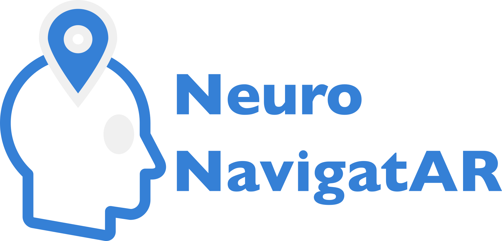

<p align="center">
  
</p>

# NeuroNavigatAR (NNAR) - Augmented Reality Tool for Real-Time Optode/Electrode Placement

NeuroNavigatAR (NNAR) is an augmented reality (AR) tool designed to visualize optode/electrode positions based on the 10-20 (10-10, 10-5) system in real time. This tool assists users locating the sensor positions for neuroimaging setups.

## Table of Contents
- [Features](#features)
- [Installation](#installation)
  - [Clone the repository](#clone-the-repository)
  - [Environment Setup](#environment-setup)
- [Usage](#usage)
- [Citation](#citation)

## Features
- Real-time AR visualization of optode/electrode positions (10-20, 10-10, 10-5 systems)
- Supports Colin27 and age-matched atlases (ages 20–84 in 5-year intervals)
- Works with external webcams or built-in laptop cameras

## Installation

### Clone the repository
```bash
git clone git@github.com:COTILab/NeuroNavigatAR.git
cd NeuroNavigatAR
```

### Environment Setup
There are two options for setting up the environment:

#### Option 1: Using Conda (Recommended)
```bash
conda env create -f environment.yml
conda activate nnar
```

#### Option 2: Using pip
```bash
pip install -r requirements.txt
```

## Usage
You can execute the tool in one of the following ways:
#### Option 1: Run the Python script
```bash
python main.py
```
#### Option 2: Use the Jupyter Notebook
```bash
jupyter notebook NNAR_GUI.ipynb
```

## Citation
If you use this tool in your research, please cite the following papers:

F. Yen, Y. Lin, and Q. Fang, "Real-time guidance for fNIRS headgear placement using augmented reality," in Optica Biophotonics Congress: Biomedical Optics 2024 (Translational, Microscopy, OCT, OTS, BRAIN), Technical Digest Series (Optica Publishing Group, 2024), paper BW1C.6.

Dai, H., Pears, N., Smith, W., & Duncan, C. (2019). Statistical Modeling of Craniofacial Shape and Texture. International Journal of Computer Vision, 128(2), 547–571. https://doi.org/10.1007/s11263-019-01260-7
